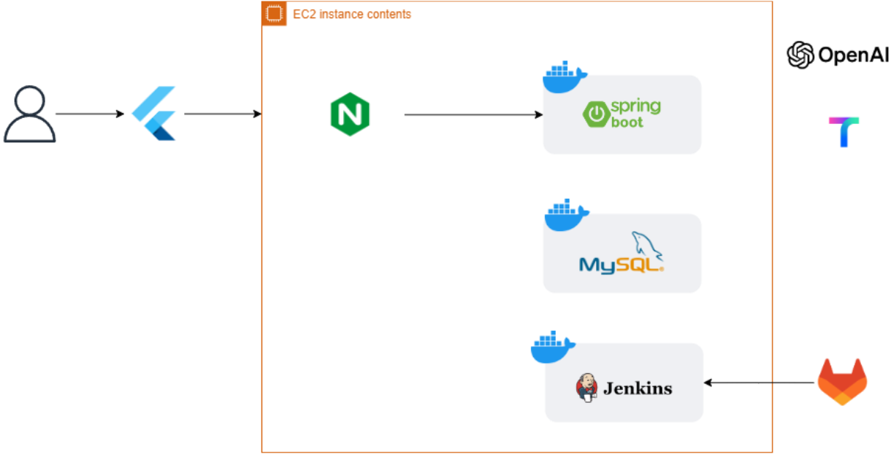
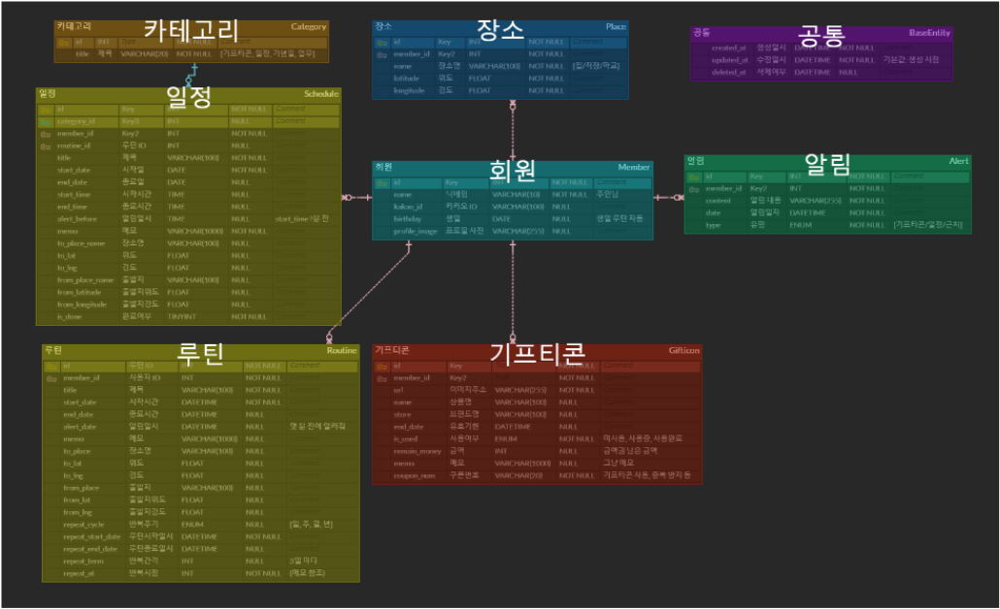

# 🐹 쮝사 - 내 손 안의 작은 집사  
**삼성 청년 SW 아카데미** 10기 서울 2반 2조 369팀

#### 목차

1. [프로젝트 소개](#-프로젝트-소개)   
2. [기능](#-기능)
3. [서비스 화면](#-서비스-화면)
5. [팀원 소개](#-팀원-소개)  

 

## 🐹 프로젝트 소개

### 📅 프로젝트 기간
2024.04.09 - 2024.05.20 (7주)
> **기획 및 설계** : 2024.04.09 - 2023.04.30 (3주)
>
> **기능 구현** : 2024.05.01 - 2024.05.20 (4주)
  

 

###  💡 서비스 개요
#### 배경
해야할 일을 메모하고도 떠올리지 못하거나, 기프티콘의 유효기간, 남은 금액, 사용여부를 까먹는 일이 많이 발생
#### 목표
일상에서 잊어버리기 쉬운 일들을 기록하고 까먹지 않게 챙겨주는 서비스 제작

 

### 🐥 기술 스택
|구분|기술|
|:---|:---|
|Infra||
|Frontend||
|Backend||
|Management Tool|
|IDE||

 

## 🐣 기능

|구분|기능|설명|비고|
|--|--|--|--|
|1|일정 관리|✔ 자연어 형식 일정을 자동으로 인식하여 생성 ✔ 반복 일정 생성 ✔ 대시보드에서 오늘의 일정, 일정 통계 확인 ✔ 등록된 일정의 위치에 가까워지면 해당 일정 알림|-TMAP API 사용 -Open API 사용|
|2|기프티콘 관리|✔ 기프티콘 이미지를 인식하여 자동으로 등록 ✔ 유효기간과 남은 금액 관리|-CLOVA OCR 활용하여 이미지 인식| 
|3|대시보드 및 통계|✔ 당일의 일정 정보들을 모아서 확인 ✔ 전체 일정 달성률과 카테고리별, 주간 달성률 시각적으로 확인 가능||      

 
 
 

## 🔍 서비스 화면
#### 대시보드
##### 홈 화면 대시보드 
전체 일정 달성률, 오늘의 일정 주요 정보들을 모아서 확인 가능  

  
#### 일정 관리
##### 일정 관리 캘린더 
캘린더 형식으로 일정을 모아서 확인 가능  
   
캘린더 날짜를 터치하여 해당 날짜의 일정 목록 확인 및 완료 체크 가능    
   
##### 일정 등록  
4가지 카테고리(일정, 업무, 기념일, 공부)를 구분하여 일정 정보를 등록 가능    
일정 시간, 장소, 알림, 반복 여부, 메모 등을 등록   
일정 수행 장소 및 출발지를 입력하면 이동 방법(대중교통, 자가용, 도보) 별로 예상 이동 시간 안내  
  
일정 수행 장소를 검색하여 등록 가능  
  
##### 일정 상세
등록한 정보 확인 가능  
  
  
#### 기프티콘
##### 기프티콘 목록
7일 내로 만료되는 기프티콘이 있는지 안내, 사용 가능/완료 탭을 통해 사용자가 가진 기프티콘 확인 가능    
기프티콘 위에 찍히는 '사용 중', '사용 완료', '기간 만료' 스탬프를 통해 편리한 상태 관리    

  
##### 기프티콘 등록
사용자의 갤러리에서 이미지를 선택하고, 미리보기 및 다시 선택 가능    
이미지 정보를 인식하여 자동으로 기프티콘명, 브랜드명, 바코드, 유효기간, (금액권일 경우)금액 정보 입력    

  
##### 기프티콘 상세
등록된 기프티콘 등록 정보와 남은 기간, (금액권일 경우) 사용 후 남은 금액 확인 가능    
  
금액권일 경우 사용하기 버튼 터치로 사용한 금액 입력 및 사용 후 금액 확인 가능  
  
  
#### 마이페이지
##### 내 정보
사용자의 프로필 정보 및 수정, 로그아웃 가능    
    
##### 내 장소
사용자가 자주 가는 장소(ex. 집, 회사, 학교 등) 정보를 미리 등록하여 일정관리에 사용 가능   
  
##### 달성 통계
전체 일정 달성률, 카테고리별 달성률, 주간 달성률 확인 가능   
  
##### 집사 정보  

  

 

## 🦜 설계

**인프라 아키텍쳐**

 

**ERD**

**외부 문서**
- [와이어프레임](https://www.figma.com/design/9TAmxpJ0IR71gbQ0Q22BwS/A202)

 
 
 

### 🕊 실행방법

exec 폴더 내 포팅 메뉴얼 참조

 
 
 

## 👨‍👩‍👧‍👦 팀원 소개 

**삼성 청년 SW 아카데미** 10기 서울 2반 2조 369팀

|조아영|유소연|최은비|박이언|최지원|
|:---|:---|:---|:---|:---|
|FE|BE/Infra|FE|BE/Infra|FE/BE|
|로그인/대시보드 마이페이지|로그인/대시보드 API 날씨 정보|일정화면 지도|일정/소요시간 API 자연어 일정 인식|기프티콘 OCR|
